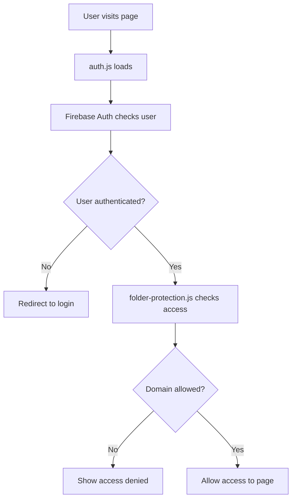

# HealthLuminate Authentication & Folder Protection System

## 📋 Overview

This is a comprehensive authentication and folder-based access control system for HealthLuminate. It provides secure, domain-based access control with centralized management through Firebase.

**Important Updates:**
- **January 2025 (v1.2)**: Fixed false "logged out" auth state changes that were causing unwanted redirects to login page
- **January 2025 (v1.1)**: User tracking to Firestore is now optional. Authentication will succeed even if users don't have write permissions to the `users` collection. This allows external users (like those from highspring.com) to authenticate successfully.

## 🏗️ System Architecture

### Core Components

1. **`js/auth.js`** - Main authentication handler
2. **`js/folder-protection.js`** - Centralized folder access control
3. **`admin/users.html`** - Admin panel for managing users and permissions
4. **`firestore.rules`** - Firestore security rules
5. **`database.rules.json`** - Realtime Database security rules

### How It Works



## 🚀 Quick Start for New Pages

### 1. Basic Protected Page

Add this to your HTML `<head>` section:

```html
<!DOCTYPE html>
<html lang="en">
<head>
    <meta charset="UTF-8">
    <meta name="viewport" content="width=device-width, initial-scale=1.0">
    <title>Your Page Title</title>
    
    <!-- Load Font Awesome (if needed) -->
    <link rel="stylesheet" href="https://cdnjs.cloudflare.com/ajax/libs/font-awesome/6.4.0/css/all.min.css">
    
    <!-- Load HealthLuminate Auth System -->
    <script src="/js/auth.js"></script>
    <script src="/js/folder-protection.js"></script>
</head>
<body>
    <!-- Your content here -->
    
    <!-- Auto-protect this folder -->
    <script>
        window.firebaseReady.then(() => {
            // Replace 'yourfolder' with your actual folder name
            window.protectFolder('yourfolder');
        });
    </script>
</body>
</html>
```

### CRITICAL: Required Header Elements

⚠️ **IMPORTANT**: Your page MUST include these hidden auth elements, or authentication will fail with a timeout:

```html
<body>
    <!-- Hidden auth elements required by auth.js -->
    <div id="auth-loading" style="display: none;">Loading...</div>
    <div id="not-logged-in" style="display: none;">Not logged in</div>
    <div id="logged-in" style="display: none;">Logged in</div>
    
    <!-- Your actual page content -->
    <div id="your-content">
        ...
    </div>
</body>
```

Without these elements, auth.js will wait for them and eventually timeout, causing authentication to fail.

### 2. Manual Protection with Custom Options

```html
<script>
    window.firebaseReady.then(async () => {
        const hasAccess = await window.protectFolder('yourfolder', {
            allowOnError: false,        // Strict: deny access on errors
            allowOnMissing: false,      // Strict: deny if no permissions found
            requireAuth: true,          // Require user to be logged in
            customMessage: 'Contact admin@yourcompany.com for access to this section.'
        });
        
        if (hasAccess) {
            console.log('✅ User has access to this folder');
            // Initialize your page-specific functionality here
        }
    });
</script>
```

### 3. Check Access Without Redirecting

```html
<script>
    window.firebaseReady.then(async () => {
        const hasAccess = await window.checkFolderAccess('yourfolder');
        
        if (hasAccess) {
            document.getElementById('protected-content').style.display = 'block';
        } else {
            document.getElementById('public-content').style.display = 'block';
        }
    });
</script>
```

## 🔧 Configuration Options

### protectFolder(folderName, options)

| Option | Type | Default | Description |
|--------|------|---------|-------------|
| `allowOnError` | boolean | `false` | Allow access if there's an error checking permissions |
| `allowOnMissing` | boolean | `false` | Allow access if folder permissions don't exist |
| `requireAuth` | boolean | `true` | Require user to be authenticated |
| `customMessage` | string | `null` | Custom message to show on access denied |

### checkFolderAccess(folderName, userEmail, options)

| Parameter | Type | Description |
|-----------|------|-------------|
| `folderName` | string | Name of the folder to check |
| `userEmail` | string | Optional: specific user email to check |
| `options` | object | Same options as `protectFolder` |

## 📁 Folder Management

### Setting Up a New Protected Folder

1. **Go to Admin Panel**: `/admin/users.html`
2. **Add New Folder**: Use the "Add New Protected Folder" form
3. **Configure Permissions**: Add allowed domains to the folder
4. **Test Access**: Try accessing the folder with different user accounts

### Folder Naming Convention

- Use lowercase letters and numbers only
- No spaces or special characters
- Examples: `kba`, `crm`, `hospitalpages`, `healthtalent`

## 🎯 Domain-Based Access Control

### Admin Domains (Always Have Access)
- `healthluminate.com`
- `careluminate.com`

### How Permissions Work

1. **Admin Override**: Admin domains always have access
2. **Folder Permissions**: Check Firestore `folderPermissions` collection
3. **Domain Matching**: User's email domain must be in `allowedDomains` array
4. **Wildcard Support**: Use `*` in `allowedDomains` for public access

### Current Firebase Realtime Database Rules

The current Firebase Realtime Database rules are:

```json
{
  "rules": {
    // Any authenticated user can write
    ".write": "auth != null && auth.token.email_verified === true",
    
    // Any authenticated user can read - the app will enforce folder permissions
    ".read": "auth != null && auth.token.email_verified === true",
    
    // Optional: Add path-specific rules for sensitive data
    "users": {
      ".read": "auth != null && auth.token.email_verified === true && (auth.token.email.endsWith('@careluminate.com') || auth.token.email.endsWith('@healthluminate.com'))",
      ".write": "auth != null && auth.token.email_verified === true && (auth.token.email.endsWith('@careluminate.com') || auth.token.email.endsWith('@healthluminate.com'))"
    }
  }
}
```

These rules allow:
- **Read access**: Any authenticated user with verified email
- **Write access**: Any authenticated user with verified email  
- **Special restriction**: The `users` path is restricted to admin domains only

This setup allows authenticated users to use features like potluck signups, surveys, and other collaborative tools without needing folder-level permissions.

### CRITICAL: Firestore Rules for Folder Permissions

⚠️ **IMPORTANT**: ALL authenticated users need to be able to READ the `folderPermissions` collection to check if they have access. Update your Firestore rules to:

```
rules_version = '2';
service cloud.firestore {
  match /databases/{database}/documents {
    // Allow ALL authenticated users to READ folder permissions
    match /folderPermissions/{folder} {
      allow read: if request.auth != null && request.auth.token.email_verified == true;
      allow write: if request.auth != null && 
        request.auth.token.email_verified == true && 
        (request.auth.token.email.matches('.*@healthluminate.com') || 
         request.auth.token.email.matches('.*@careluminate.com'));
    }
    
    // Users collection - allow users to read/write their own data
    match /users/{userId} {
      // Allow users to read their own data
      allow read: if request.auth != null && 
        request.auth.token.email_verified == true && 
        request.auth.uid == userId;
      
      // Allow users to write their own data OR admins to write any
      allow write: if request.auth != null && 
        request.auth.token.email_verified == true && 
        (request.auth.uid == userId ||
         request.auth.token.email.matches('.*@healthluminate.com') || 
         request.auth.token.email.matches('.*@careluminate.com'));
    }
  }
}
```

Without the read permission on `folderPermissions`, external users will get "Missing or insufficient permissions" errors and won't be able to access any pages.

### Example Permission Document

```json
{
  "name": "CRM System",
  "description": "Customer relationship management tools",
  "allowedDomains": [
    "healthluminate.com",
    "careluminate.com",
    "client1.com",
    "client2.com"
  ]
}
```

## 🔐 Security Features

### Authentication Requirements
- ✅ User must be logged in with Firebase Auth
- ✅ Email must be verified (Firebase OR manual admin verification)
- ✅ Domain-based access control
- ✅ Secure Firestore and Realtime Database rules

### Centralized Verification System

**IMPORTANT**: As of January 2025, all pages should use the centralized verification system instead of checking `user.emailVerified` directly. This ensures manual admin verification is respected across all pages.

#### The Problem
Individual pages were checking `user.emailVerified` directly, ignoring users who were manually verified by admins through the admin panel. This caused access issues for users who:
- Had unverified Firebase Auth emails
- Were manually verified by admins in Firestore 
- Should have access based on admin verification

#### The Solution: Centralized Verification Check

Instead of checking `user.emailVerified` directly, pages should check the centralized auth state:

```javascript
// ❌ OLD WAY - Only checks Firebase Auth verification
if (!user.emailVerified) {
  // Blocks manually verified users
  redirectToLogin();
  return;
}

// ✅ NEW WAY - Uses centralized auth system
console.log('🔍 Checking verification status via centralized auth system...');

let verificationChecks = 0;
const maxVerificationChecks = 50; // 5 seconds max wait
let isVerifiedByCentralAuth = false;

while (verificationChecks < maxVerificationChecks) {
  // Check if window.authState exists and has current verification info
  if (window.authState && window.authState.hasOwnProperty('isVerified')) {
    console.log('✅ Found centralized auth state:', window.authState);
    
    if (window.authState.isVerified) {
      console.log('✅ User verified via centralized auth system');
      if (window.authState.verificationMethod) {
        console.log('✅ Verification method:', window.authState.verificationMethod);
      }
      isVerifiedByCentralAuth = true;
      break; // User is verified, continue
    } else {
      console.log('❌ User not verified according to centralized auth system');
      break; // Exit loop, user is not verified
    }
  }
  
  // Wait and try again
  await new Promise(resolve => setTimeout(resolve, 100));
  verificationChecks++;
}

// Check verification status with fallbacks
if (!isVerifiedByCentralAuth) {
  // Fallback checks for special cases (if applicable)
  if (user.email.endsWith('@yourdomain.com')) {
    console.log('✅ Allowing access for special domain user');
    isVerifiedByCentralAuth = true;
  } else {
    console.log('❌ User not verified, redirecting to login');
    alert('Please verify your email address or ask an admin to verify your account.');
    redirectToLogin();
    return;
  }
} else {
  console.log('✅ User verification confirmed via centralized auth system');
}
```

#### How Centralized Verification Works

1. **Auth.js checks multiple sources**:
   - Firebase Auth `emailVerified` property
   - Firestore `emailVerified` field (set by admins)
   - Special admin verification flags

2. **Updates window.authState** with consolidated verification status:
   ```javascript
   window.authState = {
     isVerified: true,  // Combined verification status
     verificationMethod: 'manual-admin', // How they were verified
     // ... other auth state
   }
   ```

3. **Pages use centralized state** instead of checking Firebase Auth directly

#### Verification Methods Supported

- **`email`**: Standard Firebase Auth email verification
- **`manual-admin`**: Admin manually verified user in admin panel
- **`domain-override`**: Special domain with automatic access

#### Implementation Examples

**For pages that redirect on no verification:**
```javascript
// In your auth state handler (like hotsheet.html, analytics.html)
onAuthStateChanged(auth, async (user) => {
  if (!user) {
    redirectToLogin();
    return;
  }
  
  // Use centralized verification check
  const isVerified = await checkCentralizedVerification();
  
  if (!isVerified) {
    alert('Please verify your email address or ask an admin to verify your account.');
    redirectToLogin();
    return;
  }
  
  // User is verified, proceed with page logic
  initializePage();
});
```

**For pages that show different content (like messaging.html):**
```javascript
// In your auth state handler
onAuthStateChanged(auth, async (user) => {
  if (user) {
    const isVerified = await checkCentralizedVerification();
    
    if (isVerified) {
      // Show full functionality
      currentUser = user;
      loadUserMessages();
    } else {
      // Show limited functionality
      currentUser = null;
      document.getElementById('userName').textContent = 'User (Not Verified)';
      showDefaultMessages();
    }
  }
});
```

#### Migration Guide

To update existing pages to use centralized verification:

1. **Find verification checks** in your page:
   ```javascript
   // Look for patterns like:
   if (!user.emailVerified) { ... }
   if (user && user.emailVerified) { ... }
   ```

2. **Replace with centralized check**:
   ```javascript
   // Replace with the centralized verification pattern shown above
   const isVerified = await checkCentralizedVerification();
   ```

3. **Add fallback logic** if needed for special domains

4. **Test thoroughly** with:
   - Firebase-verified users
   - Admin-verified users  
   - Unverified users
   - Users from special domains

#### When to Use Centralized Verification

**Use centralized verification when:**
- Your page has custom authentication logic beyond simple folder protection
- You need to show different content based on verification status  
- You're using Firebase services that require authenticated state
- You have domain-specific fallback logic
- You need fine-grained control over the verification process

**Use automatic folder protection when:**
- You just need basic "access or redirect" behavior
- Your page doesn't have complex authentication requirements
- You want the simplest possible implementation

```javascript
// Simple folder protection (recommended for most pages)
window.firebaseReady.then(() => {
    window.protectFolder('yourfolder'); // Handles everything automatically
});

// VS

// Custom verification (use when you need more control)
onAuthStateChanged(auth, async (user) => {
    const isVerified = await verifyUserAccess(user, ['special.com']);
    // ... custom logic based on verification
});
```

#### Benefits

✅ **Consistent verification** across all pages
✅ **Respects admin verification** decisions
✅ **Fallback support** for special cases
✅ **Better user experience** for manually verified users
✅ **Centralized management** through admin panel
✅ **Backward compatible** with existing Firebase Auth verification

### Best Practices
1. **Always use HTTPS** in production
2. **Use centralized verification** instead of checking `user.emailVerified` directly
3. **Regular security audits** of folder permissions
4. **Monitor access logs** in Firebase Console
5. **Use strict options** (`allowOnError: false`) for sensitive folders
6. **Test with different verification states** during development

## 🔄 Available Global Functions

### Authentication Functions
```javascript
// Check if user is authenticated
window.getCurrentAuthState()

// Check if Firebase is ready
window.isFirebaseReady()

// Redirect to login with message
window.redirectToLogin('Custom message')

// Require authentication (redirects if not logged in)
window.requireAuth('You must be logged in to access this.')
```

### Folder Protection Functions
```javascript
// Check folder access
await window.checkFolderAccess('foldername')

// Protect folder (with redirect)
await window.protectFolder('foldername', options)

// Show access denied page
window.showAccessDenied('foldername', userEmail, customMessage)

// Get domain from email
window.getDomainFromEmail('user@example.com')

// Check if domain is admin
window.isAdminDomain('healthluminate.com')
```

### Centralized Verification Helper Functions

For implementing the centralized verification pattern, you can use these helper functions:

```javascript
// Helper function to check centralized verification status
async function checkCentralizedVerification(maxWaitTime = 5000) {
  console.log('🔍 Checking verification status via centralized auth system...');
  
  let verificationChecks = 0;
  const maxVerificationChecks = maxWaitTime / 100; // 100ms intervals
  
  while (verificationChecks < maxVerificationChecks) {
    // Check if window.authState exists and has current verification info
    if (window.authState && window.authState.hasOwnProperty('isVerified')) {
      console.log('✅ Found centralized auth state:', window.authState);
      
      if (window.authState.isVerified) {
        console.log('✅ User verified via centralized auth system');
        if (window.authState.verificationMethod) {
          console.log('✅ Verification method:', window.authState.verificationMethod);
        }
        return true;
      } else {
        console.log('❌ User not verified according to centralized auth system');
        return false;
      }
    }
    
    // Wait and try again
    await new Promise(resolve => setTimeout(resolve, 100));
    verificationChecks++;
  }
  
  console.log('⚠️ Centralized auth state not available after waiting');
  return false;
}

// Helper function for domain-based fallback verification
function checkDomainFallback(userEmail, allowedDomains = []) {
  if (!userEmail || !allowedDomains.length) return false;
  
  const domain = userEmail.split('@')[1]?.toLowerCase();
  const hasAccess = allowedDomains.includes(domain);
  
  if (hasAccess) {
    console.log(`✅ Allowing access for ${domain} domain user`);
  }
  
  return hasAccess;
}

// Complete verification check with fallbacks
async function verifyUserAccess(user, specialDomains = []) {
  if (!user) {
    console.log('❌ No user provided');
    return false;
  }
  
  // Try centralized verification first
  const centrallyVerified = await checkCentralizedVerification();
  if (centrallyVerified) {
    return true;
  }
  
  // Try domain fallback if specified
  if (specialDomains.length > 0) {
    const domainAllowed = checkDomainFallback(user.email, specialDomains);
    if (domainAllowed) {
      return true;
    }
  }
  
  // Try Firebase Auth verification as last resort
  if (user.emailVerified) {
    console.log('✅ User verified via Firebase Auth');
    return true;
  }
  
  console.log('❌ User not verified by any method');
  return false;
}

// Usage example:
onAuthStateChanged(auth, async (user) => {
  if (!user) {
    redirectToLogin();
    return;
  }
  
  const isVerified = await verifyUserAccess(user, ['clear.com', 'clearme.com']);
  
  if (!isVerified) {
    alert('Please verify your email address or ask an admin to verify your account.');
    redirectToLogin();
    return;
  }
  
  // User is verified, proceed with page logic
  initializePage();
});
```

## 📊 User Management

### Admin Panel Features (`/admin/users.html`)

1. **User Overview**: See all registered users by domain
2. **User Actions**:
   - View detailed user information
   - Verify/unverify users manually
   - Delete users from database
   - Sign in as user (impersonation)
   - Fix user data issues

3. **Folder Management**:
   - Create new protected folders
   - Add/remove domains from folders
   - Delete folders
   - View folder permissions

### User Data Structure

```json
{
  "uid": "firebase-user-id",
  "email": "user@example.com",
  "displayName": "User Name",
  "domain": "example.com",
  "emailVerified": true,
  "createdAt": "2024-01-01T00:00:00Z",
  "lastLogin": "2024-01-01T00:00:00Z",
  "isAdmin": false,
  "photoURL": "https://...",
  "phoneNumber": "+1234567890"
}
```

## 🛠️ Troubleshooting

### Common Issues

#### "Firebase not initialized"
```javascript
// Check if Firebase is ready
if (!window.isFirebaseReady()) {
    console.log('Waiting for Firebase...');
    window.firebaseReady.then(() => {
        console.log('Firebase is ready!');
    });
}
```

#### "Access denied but should have access"
1. Check user's email domain
2. Verify folder permissions in admin panel
3. Check browser console for error messages
4. Ensure user's email is verified
5. Check that the folder name in `checkFolderAccess()` matches exactly what's in Firestore

#### "Headers not loading" / "Auth timeout"
Make sure your HTML includes the authentication elements:
```html
<div id="auth-loading">Loading...</div>
<div id="not-logged-in" style="display: none;">Please log in</div>
<div id="logged-in" style="display: none;">Welcome!</div>
```

#### "User tracking failed (non-critical)"
This is NORMAL for users without write permissions to Firestore. The warning:
```
⚠️ User tracking failed (non-critical): Missing or insufficient permissions.
ℹ️ This is expected for users without write permissions to the users collection
```
This doesn't affect authentication - users can still access pages they're authorized for.

#### "Page redirects to login after ~20 seconds even though logged in"
**Fixed in v1.3 (January 2025)**

This was caused by pages having a timeout fallback that redirected to login if the page was still hidden after 15 seconds. The fix involves:

1. **Auth.js now tracks activity**: Sets `window._authSystemActive` and `window._authLastActivity`
2. **Pages check auth state before redirecting**: Before timing out, pages now verify:
   - If auth system has recent activity (within 30 seconds)
   - If `window.auth.currentUser` exists
   - If the page is actually hidden AND no user is logged in

To fix this in your own pages, replace simple timeout redirects:
```javascript
// OLD - Don't do this
setTimeout(() => {
  if (document.documentElement.style.display === 'none') {
    window.location.href = '../login.html';
  }
}, 15000);
```

With proper auth state checking:
```javascript
// NEW - Do this instead
setTimeout(() => {
  // Check if auth system is active before redirecting
  if (window._authSystemActive && window._authLastActivity) {
    const timeSinceActivity = Date.now() - window._authLastActivity;
    if (timeSinceActivity < 30000) {
      console.log('✅ Auth system is active, not redirecting');
      return;
    }
  }
  
  // Also check if user is actually logged in
  if (window.auth && window.auth.currentUser) {
    console.log('✅ User is logged in, not redirecting');
    document.documentElement.style.display = 'block';
    return;
  }
  
  // Only redirect if really needed
  if (document.documentElement.style.display === 'none' && !window.currentUser) {
    console.log('⚠️ Auth timeout - redirecting to login');
    window.location.href = '../login.html';
  }
}, 30000); // 30 seconds instead of 15
```

#### "CRITICAL: Pages with embedded auth code still redirecting"
**Fixed in v1.3.1 (January 2025)**

Some pages (like hotsheetsprospecting.html) have embedded auth code instead of using the centralized auth.js. These pages need special handling:

**The Problem**: When auth state changes to "not logged in" (even falsely), embedded auth code immediately redirects.

**The Solution**: Add double-checking logic in the auth callback:
```javascript
// In the authStateChanged/hotsheetAuthCheck callback:
else if (!authState.isChecking && !authState.isLoggedIn) {
  console.log('🔒 Auth state indicates user not logged in, double-checking...');
  
  // Double-check the actual Firebase auth state
  if (window.auth && window.auth.currentUser) {
    console.log('✅ Firebase auth still has current user, ignoring false auth state change');
    document.documentElement.style.display = 'block';
    return;
  }
  
  // Check if we already have a current user set
  if (window.currentUser || window.hotsheetCurrentUser) {
    console.log('✅ Current user already set, ignoring false auth state change');
    document.documentElement.style.display = 'block';
    return;
  }
  
  // Wait and check again to avoid race conditions
  setTimeout(() => {
    if (window.auth && window.auth.currentUser) {
      console.log('✅ Firebase auth has current user after delay, not redirecting');
      document.documentElement.style.display = 'block';
    } else {
      // Only redirect if we're really sure
      console.log('❌ User confirmed not logged in, redirecting to login');
      window.location.href = '../login.html';
    }
  }, 1000);
}
```

**Important**: If you're still experiencing redirects, check browser console for which redirect is triggering and apply the appropriate fix.

#### "Page redirects to login after 20-30 seconds despite being authenticated"
**Fixed in v1.3.5 (January 2025)**

This was caused by auth.js continuously retrying to find header elements in the background:

1. **Root Cause**: The `waitForHeaderElements()` function kept retrying indefinitely
2. **Symptoms**: Console shows repeated "Header elements not found, retrying..." messages
3. **Impact**: Could trigger unexpected auth state changes after the initial load

The fix has two parts:

1. **Auth.js improvements**:
   - Properly tracks and cancels timeout IDs
   - Stops all retries once resolved

2. **Required page elements** - All pages using auth.js MUST include these hidden elements:
   ```html
   <!-- Hidden auth elements required by auth.js -->
   <div id="auth-loading" style="display: none;">Loading...</div>
   <div id="not-logged-in" style="display: none;">Not logged in</div>
   <div id="logged-in" style="display: none;">Logged in</div>
   ```

If you still experience this issue:
- Check console for continuous "Header elements not found" messages
- Ensure your page has at least one of these elements: `auth-loading`, `not-logged-in`, or `logged-in`
- Clear browser cache and reload

#### "Analytics page shows 'must be logged in' error despite being authenticated"
**Fixed in v1.3.3 (January 2025)**

This occurs when the analytics page checks for authentication before the auth state is fully resolved. The fix:

1. **Enhanced auth waiting**: Analytics now waits up to 10 seconds for auth state to resolve
2. **Periodic checks**: Checks every 500ms for authenticated user
3. **Auto-retry**: If user logs in after page loads, it automatically refreshes
4. **Better messaging**: Shows helpful message to refresh if already logged in

If you still see this error:
- Refresh the page (F5 or Ctrl+R)
- Clear browser cache and try again
- Check console for any Firebase errors

#### "CRITICAL: Module-based pages causing Firebase duplicate app error"
**Fixed in v1.3.2 (January 2025)**

Some pages (like vasion/hotsheet.html) use ES6 modules that initialize Firebase independently. This can cause:
- "Firebase App named '[DEFAULT]' already exists" error
- Auth.js fails and sets auth state to "not logged in"
- Page redirects after ~20 seconds

**The Solution**: Check for existing Firebase instances before initializing:

```javascript
// In your module's Firebase initialization
async function initializeFirebaseAuth() {
    // Wait for auth.js to initialize first
    let attempts = 0;
    while (!window.auth && !window.firebaseApp && attempts < 100) {
        await new Promise(resolve => setTimeout(resolve, 100));
        attempts++;
    }
    
    // Check if Firebase is already initialized
    if (window.firebaseApp && window.auth && window.db) {
        console.log('✅ Using existing Firebase instances from auth.js');
        app = window.firebaseApp;
        auth = window.auth;
        realtimeDb = getDatabase(app);
        firestoreDb = window.db;
    } else {
        // Only initialize if not already done
        try {
            const { getApp } = await import('firebase-app');
            app = getApp(); // Try to get existing app
        } catch (e) {
            app = initializeApp(firebaseConfig); // Create new if needed
        }
        // ... rest of initialization
    }
}
```

**Also add protection in your auth state handler**:
```javascript
onAuthStateChanged(auth, async (user) => {
    if (!user) {
        // Double-check before redirecting
        if (window.auth && window.auth.currentUser) {
            console.log('✅ User still logged in, ignoring false state');
            return;
        }
        
        // Wait and check again
        await new Promise(resolve => setTimeout(resolve, 1000));
        if (window.auth && window.auth.currentUser) {
            return;
        }
        
        // Only redirect if really not logged in
        window.location.href = '../login.html';
    }
});
```

#### "User manually verified by admin but can't access pages"
**Fixed in January 2025**

This occurs when pages check `user.emailVerified` directly instead of using the centralized verification system.

**Symptoms:**
- Admin panel shows user as "Verified" with "Manual verification by admin@example.com"
- User gets "Please verify your email address" error when accessing pages
- Console shows: `✅ User manually verified by admin` but page still blocks access

**Root Cause:**
Individual pages were checking Firebase Auth's `emailVerified` property directly, which doesn't reflect manual admin verification stored in Firestore.

**Solution:**
Update pages to use centralized verification check:

```javascript
// Replace this pattern:
if (!user.emailVerified) {
  redirectToLogin();
  return;
}

// With centralized verification check:
let verificationChecks = 0;
let isVerifiedByCentralAuth = false;

while (verificationChecks < 50) {
  if (window.authState?.hasOwnProperty('isVerified')) {
    if (window.authState.isVerified) {
      isVerifiedByCentralAuth = true;
      break;
    } else {
      break;
    }
  }
  await new Promise(resolve => setTimeout(resolve, 100));
  verificationChecks++;
}

if (!isVerifiedByCentralAuth) {
  // Add fallback for special domains if needed
  if (user.email.endsWith('@specialdomain.com')) {
    isVerifiedByCentralAuth = true;
  } else {
    alert('Please verify your email address or ask an admin to verify your account.');
    redirectToLogin();
    return;
  }
}
```

**Files Fixed:**
- `clear/hotsheet.html` ✅
- `clear/analytics.html` ✅  
- `clear/messaging.html` ✅

#### "CRITICAL: Hotsheet pages still redirecting after 1+ minute despite fixes"
**Fixed in v1.3.7 (January 2025)**

Pages like vasion/hotsheet.html were still experiencing redirects after 60+ seconds due to Firebase auth state glitches. The comprehensive fix includes:

1. **Track dashboard initialization state**:
```javascript
let dashboardInitialized = false;
let authStateChangeCount = 0;
const pageLoadTime = Date.now();

onAuthStateChanged(auth, async (user) => {
    authStateChangeCount++;
    
    // Ignore auth changes after dashboard is initialized
    if (dashboardInitialized) {
        console.log('✅ Dashboard already initialized, ignoring auth state change');
        return;
    }
    
    // ... rest of auth handling
    
    // Mark as initialized after successful auth
    dashboardInitialized = true;
    initializeDashboard();
});
```

2. **Check auth system activity**:
```javascript
if (!user) {
    // Check if auth system had recent activity
    if (window._authSystemActive && window._authLastActivity) {
        const timeSinceActivity = Date.now() - window._authLastActivity;
        if (timeSinceActivity < 120000) { // 2 minutes
            console.log('✅ Auth system had recent activity, ignoring false auth state');
            return;
        }
    }
}
```

3. **Prevent late redirects**:
```javascript
// Check how long the page has been loaded
const pageActiveTime = Date.now() - pageLoadTime;
if (pageActiveTime > 30000) { // 30 seconds
    console.log('⚠️ Page has been active for too long, refusing to redirect');
    return;
}
```

4. **Be extra cautious on early auth state changes**:
```javascript
// For the first few auth state changes, wait longer
if (authStateChangeCount <= 2) {
    console.log(`⏳ Early auth state change, waiting longer...`);
    await new Promise(resolve => setTimeout(resolve, 3000));
    
    if (window.auth && window.auth.currentUser) {
        console.log('✅ User found after extended delay');
        return;
    }
}
```

This multi-layered approach prevents false redirects while still maintaining security.

#### "Auth.js causing false logouts when header elements timeout"
**Fixed in v1.3.8 (January 2025)**

The root cause was that `waitForHeaderElements()` would timeout after 10 seconds on pages that don't have the auth UI elements (auth-loading, not-logged-in, logged-in). This timeout could trigger or coincide with Firebase reporting a false "no user" state, causing pages to think the user logged out.

The fix includes:

1. **Reduced timeout and better messaging**:
   - Timeout reduced from 10s to 5s
   - Changed warning message to info message
   - Reduced console spam during checks

2. **Protection against false auth state changes**:
   ```javascript
   // If we had a good auth state and now getting "no user", double-check
   if (lastKnownGoodAuthState && !user && headerElementsTimedOut) {
     const timeSinceTimeout = Date.now() - (headerElementsTimedOutAt || 0);
     if (timeSinceTimeout < 10000) { // Within 10 seconds of timeout
       console.log('⚠️ Ignoring potential false "no user" state near header timeout');
       return;
     }
   }
   ```

3. **Better UI state management**:
   - Don't show "not logged in" UI if we suspect a false state
   - Track last known good auth state

This multi-layered approach prevents false redirects while still maintaining security.

#### "Login page not sharing authentication with rest of site"
**Fixed in v1.3.9 (January 2025)**

The login.html page was creating its own separate Firebase instance instead of using the centralized auth.js system. This meant users would log in successfully but other pages wouldn't recognize them as logged in.

The fix includes:

1. **Updated login.html to use centralized auth**:
   - Added `<script src="js/auth.js"></script>` to use the centralized auth system
   - Added required auth UI elements that auth.js looks for
   - Modified Firebase initialization to wait for and use the centralized auth instance

2. **Proper auth instance sharing**:
   ```javascript
   // Wait for auth.js to initialize Firebase
   async function waitForAuth() {
     if (window.firebaseReady) {
       const firebase = await window.firebaseReady;
       auth = firebase.auth || window.auth;
       db = firebase.db || window.db;
     }
   }
   ```

3. **All login functionality wrapped in setupLoginFunctionality()**:
   - Ensures all event handlers use the correct auth instance
   - Prevents race conditions during initialization

Now login.html properly shares authentication state with all other pages using auth.js.

#### "False logout after 30-60 seconds of being logged in"
**Fixed in v1.3.10 (January 2025)**

Firebase was reporting false "no user" auth state changes 30-60 seconds after successful login, causing users to be logged out unexpectedly.

The fix includes:

1. **Suspicious logout detection and prevention**:
   ```javascript
   // Check for suspicious logout (was logged in, now reporting no user)
   if (previousState.isLoggedIn && !user) {
     // If user was authenticated within the last 2 minutes, ignore this logout
     if (timeSinceGoodState < 120000) { // 2 minutes
       console.log('🛡️ Ignoring suspicious logout - user was authenticated recently');
       return; // Keep the current state - don't update to logged out
     }
   }
   ```

2. **Good auth state tracking with timestamps**:
   - Store timestamp when user successfully authenticates
   - Use this to detect and ignore false logouts within 2 minutes

3. **Explicit auth persistence setting**:
   - Set Firebase auth persistence to browserLocalPersistence
   - Ensures auth state survives page refreshes

This prevents Firebase auth glitches from logging users out unexpectedly.

## 📝 Examples

### Example 1: Simple Protected Page

```html
<!DOCTYPE html>
<html lang="en">
<head>
    <meta charset="UTF-8">
    <title>CRM Dashboard</title>
    <script src="/js/auth.js"></script>
    <script src="/js/folder-protection.js"></script>
</head>
<body>
    <h1>CRM Dashboard</h1>
    <div id="content">
        <!-- Your protected content here -->
    </div>
    
    <script>
        window.firebaseReady.then(() => {
            window.protectFolder('crm');
        });
    </script>
</body>
</html>
```

### Example 2: Conditional Content

```html
<script>
    window.firebaseReady.then(async () => {
        const isAdmin = window.isAdminDomain(
            window.getDomainFromEmail(window.auth.currentUser.email)
        );
        
        if (isAdmin) {
            document.getElementById('admin-panel').style.display = 'block';
        }
        
        const hasKBAAccess = await window.checkFolderAccess('kba');
        if (hasKBAAccess) {
            document.getElementById('kba-link').style.display = 'inline-block';
        }
    });
</script>
```

### Example 3: Custom Access Denied

```html
<script>
    window.firebaseReady.then(async () => {
        const hasAccess = await window.checkFolderAccess('premium');
        
        if (!hasAccess) {
            window.showAccessDenied('premium', null, 
                'This is a premium feature. Contact sales@healthluminate.com to upgrade your account.'
            );
        }
    });
</script>
```

### Example 4: Complex Page with Firebase Database (Based on Hotsheets Pattern)

```html
<!DOCTYPE html>
<html lang="en">
<head>
    <meta charset="UTF-8">
    <title>Data Dashboard</title>
    
    <!-- IMMEDIATE PROTECTION -->
    <script>
        // Hide content while checking auth
        document.documentElement.style.display = 'none';
    </script>
    
    <!-- Load auth system -->
    <script src="/js/auth.js"></script>
    
    <style>/* Your styles */</style>
</head>
<body>
    <!-- REQUIRED: Hidden auth elements -->
    <div id="auth-loading" style="display: none;">Loading...</div>
    <div id="not-logged-in" style="display: none;">Not logged in</div>
    <div id="logged-in" style="display: none;">Logged in</div>
    
    <!-- Your content -->
    <div id="main-content">
        <!-- Dashboard content -->
    </div>
    
    <!-- Non-module auth check -->
    <script>
        // Register auth callback
        window.dashboardAuthCheck = async function(authState) {
            if (authState.isLoggedIn && authState.isVerified) {
                // Check folder access
                const hasAccess = await window.checkFolderAccess('dashboard', authState.user.email);
                
                if (!hasAccess) {
                    showAccessDenied(authState.user.email);
                    return;
                }
                
                // Show page
                document.documentElement.style.display = 'block';
                
                // Store user for module script
                window.currentUser = authState.user;
                
                // Trigger data loading (handled by module script)
                if (window.loadDashboardData) {
                    window.loadDashboardData();
                }
            } else if (!authState.isChecking) {
                window.location.href = '/login.html';
            }
        };
        
        function showAccessDenied(email) {
            document.body.innerHTML = `
                <div style="text-align: center; padding: 50px;">
                    <h2>Access Denied</h2>
                    <p>Your account (${email}) doesn't have access to this dashboard.</p>
                    <button onclick="window.location.href='/dashboard.html'">Back to Dashboard</button>
                </div>
            `;
        }
    </script>
    
    <!-- Module script for Firebase operations -->
    <script type="module">
        import { getDatabase, ref, get, set } from "https://www.gstatic.com/firebasejs/10.7.0/firebase-database.js";
        
        // Wait for Firebase
        let retryCount = 0;
        while (!window.firebaseReady && retryCount < 20) {
            await new Promise(resolve => setTimeout(resolve, 500));
            retryCount++;
        }
        
        const app = window.firebaseApp;
        const db = getDatabase(app);
        
        // Global function for loading data
        window.loadDashboardData = async function() {
            if (!window.auth?.currentUser) {
                console.log('No authenticated user');
                return;
            }
            
            try {
                // Load your data
                const dataRef = ref(db, 'dashboard_data');
                const snapshot = await get(dataRef);
                
                if (snapshot.exists()) {
                    const data = snapshot.val();
                    renderDashboard(data);
                }
            } catch (error) {
                console.error('Error loading data:', error);
            }
        };
        
        // Check if already authenticated
        setTimeout(() => {
            if (window.currentUser) {
                window.loadDashboardData();
            }
        }, 1000);
    </script>
</body>
</html>
```

## 🔄 Migration from Old System

### Basic Pages
If you have existing pages with custom authentication:

1. **Remove old auth code**: Delete duplicate `checkFolderAccess` functions
2. **Add new scripts**: Include `auth.js` and `folder-protection.js`
3. **Update protection**: Replace old protection with `protectFolder()`
4. **Add required elements**: Include the hidden auth divs
5. **Test thoroughly**: Ensure all functionality works as expected

### Complex Pages with Firebase Integration

For pages that use Firebase services (Realtime Database, Firestore, etc.):

#### 1. Remove Duplicate Firebase Initialization
```javascript
// REMOVE this from your page:
const firebaseConfig = { ... };
const app = initializeApp(firebaseConfig);
const auth = getAuth(app);
const db = getDatabase(app);

// INSTEAD, use the centralized instance:
window.firebaseReady.then(() => {
    const auth = window.auth;
    const app = window.firebaseApp;
    const db = getDatabase(app); // Import getDatabase from Firebase SDK
});
```

#### 2. Use Module Scripts Correctly
```html
<script type="module">
    // Import Firebase modules
    import { getDatabase, ref, get, set } from "https://www.gstatic.com/firebasejs/10.7.0/firebase-database.js";
    
    // Wait for centralized Firebase
    let retryCount = 0;
    while (!window.firebaseReady && retryCount < 20) {
        await new Promise(resolve => setTimeout(resolve, 500));
        retryCount++;
    }
    
    // Use centralized app
    const app = window.firebaseApp;
    const db = getDatabase(app);
    
    // Your database operations...
</script>
```

#### 3. Handle Authentication State
```javascript
// Register auth callback
window.authStateChanged = function(authState) {
    if (authState.isLoggedIn && authState.isVerified) {
        // User is authenticated
        loadUserData();
    }
};

// Or check folder access
window.yourPageAuthCheck = async function(authState) {
    if (authState.isLoggedIn && authState.isVerified) {
        const hasAccess = await checkFolderAccess('yourfolder', authState.user.email);
        if (hasAccess) {
            // Show page content
            document.documentElement.style.display = 'block';
            loadPageData();
        } else {
            showAccessDenied(authState.user.email);
        }
    }
};
```

#### 4. Common Pitfalls to Avoid

❌ **DON'T** initialize Firebase multiple times:
```javascript
// BAD - Creates conflicts
const app1 = initializeApp(config);  // In auth.js
const app2 = initializeApp(config);  // In your page
```

❌ **DON'T** forget to wait for Firebase:
```javascript
// BAD - May fail if Firebase isn't ready
const db = getDatabase(window.firebaseApp);
```

✅ **DO** wait for Firebase to be ready:
```javascript
// GOOD - Ensures Firebase is initialized
await window.firebaseReady;
const db = getDatabase(window.firebaseApp);
```

✅ **DO** handle authentication timing:
```javascript
// GOOD - Don't assume user is immediately available
if (!window.auth?.currentUser) {
    console.log('Waiting for authentication...');
    return;
}

## 📚 Key Lessons Learned

From implementing the authentication system across complex pages like the Hotsheets, here are the critical lessons:

### 1. **Firestore Rules Must Allow Reading Folder Permissions**
- ALL authenticated users need READ access to `folderPermissions` collection
- Without this, external users get "Missing or insufficient permissions" errors
- Only restrict WRITE access to admin domains

### 2. **Required HTML Elements Are Critical**
- Pages MUST include the hidden auth elements (`auth-loading`, `not-logged-in`, `logged-in`)
- Without these, auth.js will timeout waiting for them
- Add them even if your page doesn't use the standard header

### 3. **User Tracking is Now Optional**
- As of January 2025, authentication succeeds even without write permissions to `users` collection
- External users will see a warning but can still access authorized pages
- This allows partners/clients to use the system without being tracked

### 4. **Firebase Must Be Centralized**
- NEVER initialize Firebase multiple times
- Always wait for `window.firebaseReady` before using Firebase services
- Use the centralized instance from auth.js

### 5. **Module Scripts Need Special Handling**
- Module scripts can't directly access auth state
- Use a non-module script to handle auth callbacks
- Pass user data via window variables to module scripts

## 🎉 That's It!

Your HealthLuminate authentication system is now ready to use. The system provides:

- ✅ **Secure authentication** with Firebase
- ✅ **Domain-based access control** 
- ✅ **Centralized management** through admin panel
- ✅ **Easy integration** for new pages
- ✅ **Comprehensive logging** and debugging
- ✅ **Optional user tracking** for external users

For support or questions, contact the HealthLuminate development team.

## 📝 Version History

### v1.4.0 (January 2025) - Centralized Verification System
- **MAJOR**: Implemented centralized verification system across all Clear folder pages
- **Fixed**: Manual admin verification now respected by individual pages
- **Changed**: Pages now check `window.authState.isVerified` instead of `user.emailVerified` directly
- **Updated**: Clear folder pages (hotsheet.html, analytics.html, messaging.html) to use centralized verification
- **Added**: Domain fallback logic for clear.com and clearme.com users
- **Impact**: Users manually verified by admins can now access all pages consistently

### v1.3.6 (January 2025) - Analytics Authentication Fix
- **Fixed**: Analytics page showing "must be logged in" error for authenticated users
- **Issue**: Analytics was checking authentication too early before auth state resolved
- **Solution**:
  - Added required auth header elements to analytics.html
  - Improved auth state waiting logic to handle initial "no user" state
  - Increased timeout to 20 seconds to allow for slower auth resolution
  - Added auth state change counter to avoid failing on first check
- **Impact**: Analytics page now properly waits for authentication

### v1.3.5 (January 2025) - Complete Retry Loop Fix
- **Fixed**: Auth.js infinite retry loop completely resolved
- **Issue**: The `waitForHeaderElements()` function wasn't properly canceling scheduled timeouts
- **Solution**: 
  - Added timeout IDs to track and cancel scheduled retries
  - Added required auth header elements to pages that were missing them
  - Pages now need these hidden elements: `auth-loading`, `not-logged-in`, `logged-in`
- **Impact**: Completely eliminates the continuous retry messages in console

### v1.3.3 (January 2025) - Analytics Page Auth Fix
- **Fixed**: Analytics page showing "must be logged in" error for authenticated users
- **Issue**: Analytics was checking authentication before auth state was fully resolved
- **Solution**: Added proper auth state waiting with timeout and retry mechanism
- **Added**: Auto-refresh when user logs in after analytics page loads

### v1.3.2 (January 2025) - CRITICAL FIX for Module-Based Pages
- **Fixed**: Critical auth redirect issue in vasion/hotsheet.html
- **Issue**: Module script was initializing Firebase before auth.js, causing duplicate app error
- **Solution**: Module now checks for existing Firebase instances and reuses them
- **Added**: Double-checking logic in auth state handler to prevent false redirects

### v1.3.1 (January 2025) - CRITICAL FIX
- **Fixed**: Critical auth redirect issue in hotsheetsprospecting.html
- **Issue**: Page was immediately redirecting on false auth state changes
- **Solution**: Added double-checking logic before redirecting to prevent false positives
- **Note**: Some pages (like hotsheetsprospecting.html) have embedded auth code instead of using centralized auth.js

### v1.3 (January 2025)
- **Fixed**: Critical timeout-based redirects in hotsheet pages
- **Added**: Auth system activity tracking (`window._authSystemActive` and `window._authLastActivity`)
- **Changed**: Increased timeout from 15 to 30 seconds and added proper auth checks before redirecting
- **Improved**: Pages now verify actual auth state before timing out

### v1.2 (January 2025)
- **Fixed**: False "logged out" auth state changes causing unwanted redirects
- **Added**: Auth state change deduplication to prevent duplicate callbacks
- **Added**: Suppression of initial "not logged in" state on page load
- **Improved**: Console logging for auth state debugging

### v1.1 (January 2025)
- **Changed**: User tracking to Firestore is now optional
- **Fixed**: External users can now authenticate without write permissions
- **Added**: Non-critical warning for user tracking failures

### v1.0 (December 2024)
- Initial release of centralized authentication system
- Domain-based folder access control
- Admin panel for user and permission management
- Integration with Firebase Auth and Firestore

### v1.3.9 (January 2025)
- **Fixed**: Login page not sharing authentication with rest of site
- **Issue**: Login page was creating its own separate Firebase instance
- **Solution**: Updated login.html to use centralized auth
- **Added**: Required auth UI elements and proper auth instance sharing
- **Changed**: All login functionality wrapped in setupLoginFunctionality()

### v1.3.10 (January 2025)
- **Fixed**: False logout after 30-60 seconds of being logged in
- **Issue**: Firebase reporting false "no user" state changes
- **Solution**: Detect and ignore suspicious logouts within 2 minutes of authentication
- **Added**: Timestamp tracking for good auth states
- **Changed**: Explicit auth persistence setting to browserLocalPersistence

---

*Last updated: January 2025* 